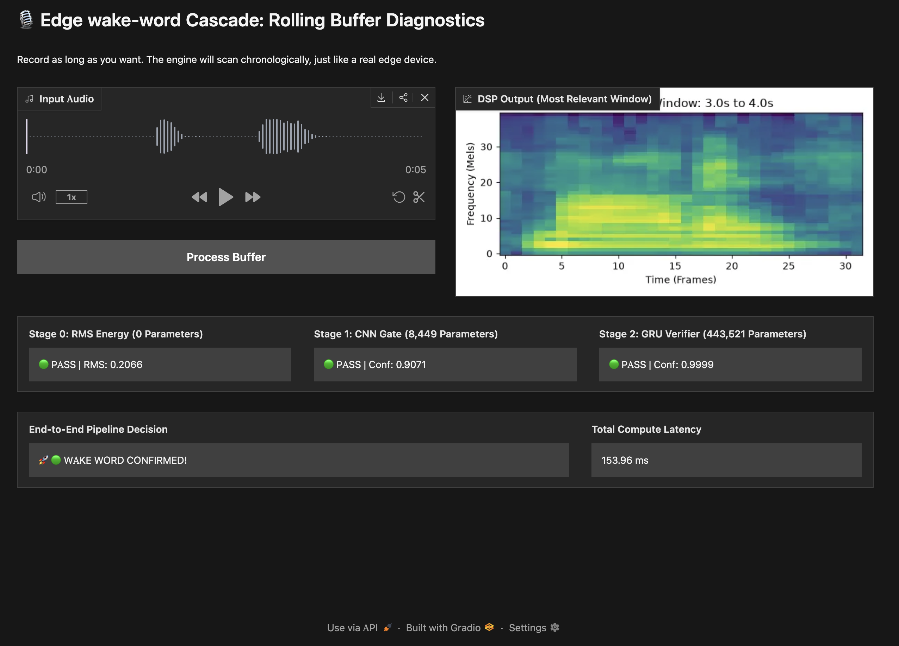
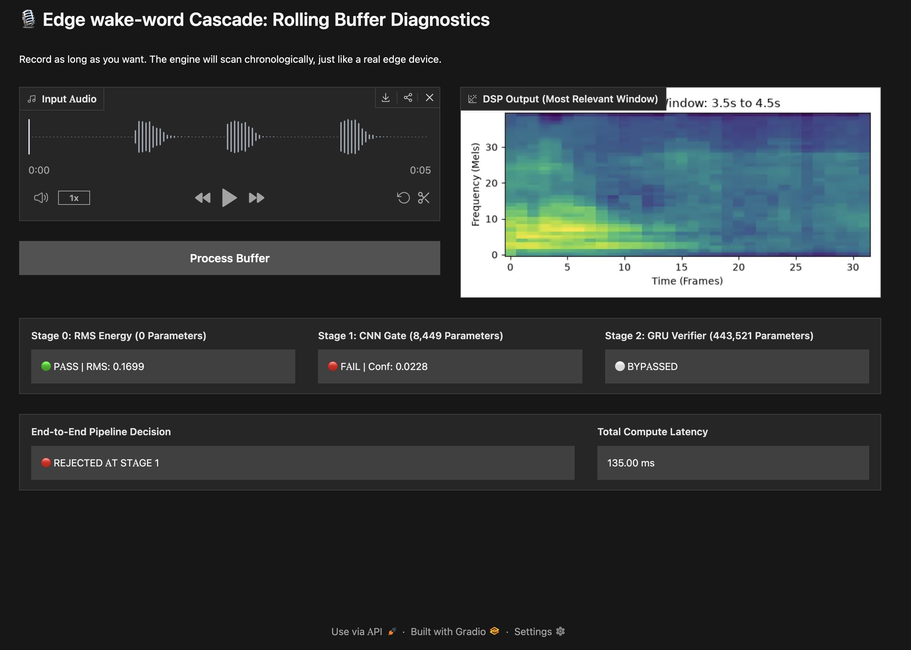

# Edge Wake Engine

Edge Wake Engine is a two-stage wake-word detection pipeline designed for edge-style inference. It combines a lightweight front-end trigger model with a heavier temporal verifier so the expensive recurrent model only runs when the cheaper trigger has already found a promising audio window.

The current implementation includes:

- A Stage 0 energy gate for fast rejection of quiet windows
- A Stage 1 depthwise-separable CNN for low-cost keyword triggering
- A Stage 2 bidirectional GRU for temporal verification
- A Gradio diagnostics app for recording audio and inspecting per-stage decisions
- Training and evaluation entry points under `src/training` and `src/evaluation`

## Architecture Overview

The runtime pipeline is a cascade:

| Stage | Purpose | Implementation | Default behavior |
| --- | --- | --- | --- |
| Stage 0 | Reject silent or near-silent audio | RMS energy gate in `src/ui/app.py` | Rejects windows with RMS energy `<= 0.005` |
| Stage 1 | Catch likely wake-word candidates with high recall | `WakeWordTriggerCNN` in `src/models/stage1_cnn.py` | Accepts windows with confidence `>= 0.70` |
| Stage 2 | Confirm the time-ordered wake-word pattern with higher precision | `WakeWordVerifierRNN` in `src/models/stage2_rnn.py` | Accepts windows with confidence `>= 0.50` |

At inference time, the app scans long recordings with a rolling buffer:

- Window size: 1.0 second
- Stride: 0.5 seconds
- Sample rate: 16 kHz
- Feature shape: `(1, 40, time_frames)` Mel spectrograms

This lets the system evaluate long clips like a streaming detector instead of requiring perfectly aligned one-second inputs.

## Repository Layout

```text
edge-wake-engine/
|-- data/
|   |-- ESC-50/
|   `-- speech_commands/
|-- demos/
|   |-- negative_example.png
|   `-- positive_example.png
|-- docs/
|   `-- CONCEPTS.md
|-- models/
|   |-- stage1_trigger.pth
|   `-- stage2_verifier.pth
|-- src/
|   |-- data_pipeline/
|   |   |-- dataset.py
|   |   |-- dsp_utils.py
|   |   |-- prepare_data.py
|   |   `-- vad.py
|   |-- evaluation/
|   |   `-- evaluate_stage1.py
|   |-- models/
|   |   |-- stage1_cnn.py
|   |   `-- stage2_rnn.py
|   |-- training/
|   |   |-- main_stage1.py
|   |   |-- main_stage2.py
|   |   `-- train_stage1.py
|   `-- ui/
|       `-- app.py
`-- requirements.txt
```

## Models

### Stage 1: Trigger CNN

- File: `src/models/stage1_cnn.py`
- Type: depthwise-separable convolutional network
- Input: single-channel Mel spectrogram
- Output: binary trigger logit
- Parameter count: 8,449 trainable parameters

This model is optimized for low compute and is intended to run continuously.

### Stage 2: Verifier GRU

- File: `src/models/stage2_rnn.py`
- Type: 2-layer bidirectional GRU
- Input: the same Mel spectrogram, reshaped into a time-major sequence
- Output: binary verification logit
- Parameter count: 443,521 trainable parameters

This model is only invoked after Stage 1 clears its threshold.

## Data Expectations

The training scripts expect the following directory layout:

```text
data/
|-- speech_commands/
|   |-- marvin/
|   |-- stop/
|   |-- go/
|   |-- yes/
|   |-- no/
|   |-- up/
|   |-- down/
|   |-- left/
|   `-- right/
`-- ESC-50/
    `-- audio/
```

### Dataset roles

- Positive class: `speech_commands/marvin`
- Speech negatives: `stop`, `go`, `yes`, `no`, `up`, `down`, `left`, `right`
- Acoustic hard negatives: all `.wav` files under `ESC-50/audio`

The current local workspace already contains both dataset roots:

- `data/speech_commands`
- `data/ESC-50/audio`

The repository code performs an 80/20 stratified train/test split in `src/data_pipeline/prepare_data.py`.

## Audio Preprocessing

`src/data_pipeline/dataset.py` handles the default training and evaluation preprocessing:

- Loads audio with `torchaudio`
- Resamples to 16 kHz when necessary
- Converts stereo to mono
- Pads or truncates every sample to exactly 1 second
- Builds a 40-bin Mel spectrogram with `n_fft=1024` and `hop_length=512`
- Converts power values to dB

The repo also includes additional reference DSP modules:

- `src/data_pipeline/vad.py` contains a classical STE/ZCR-based VAD implementation
- `src/data_pipeline/dsp_utils.py` contains a custom STFT plus Mel-filterbank path using `librosa`

Those modules are useful for experimentation and documentation, but the main training path currently uses the native `torchaudio` pipeline in `dataset.py`.

## Setup

### 1. Create and activate a virtual environment

```bash
python3 -m venv venv
source venv/bin/activate
```

### 2. Install dependencies

```bash
pip install -r requirements.txt
```

### 3. Verify required assets

Before running the training or UI scripts, make sure these exist:

- `data/speech_commands`
- `data/ESC-50/audio`

The demo app also expects trained weights:

- `models/stage1_trigger.pth`
- `models/stage2_verifier.pth`

## Training Workflow

### Train Stage 1

```bash
python -m src.training.main_stage1
```

What this does:

- Scans the datasets and creates a stratified split
- Builds Mel spectrogram tensors on the fly
- Trains the trigger CNN for 15 epochs
- Saves weights to `models/stage1_trigger.pth`

### Evaluate Stage 1

```bash
python -m src.evaluation.evaluate_stage1
```

What this does:

- Loads the unseen test split
- Applies the Stage 1 threshold of `0.70`
- Prints a classification report and confusion matrix

### Train Stage 2

```bash
python -m src.training.main_stage2
```

What this does:

- Loads the Stage 1 weights
- Runs the Stage 1 model across the training set
- Keeps all positives and mines the hardest negative examples
- Builds a balanced hard-example dataset
- Trains the GRU verifier for 15 epochs
- Saves weights to `models/stage2_verifier.pth`

Important:

- Stage 2 training requires `models/stage1_trigger.pth` to exist first

## Run the Demo UI

Launch the Gradio interface with:

```bash
python -m src.ui.app
```

By default, the app:

- Opens on `0.0.0.0:7860`
- Records from the microphone
- Scans the input in chronological one-second windows
- Displays the most relevant spectrogram window
- Reports Stage 0, Stage 1, and Stage 2 outcomes
- Stops early when a wake word is confirmed

## Demo Screenshots

### Positive example

This example clears all three stages and produces a final wake-word confirmation.



### Negative example

This example passes the energy gate but is rejected by the Stage 1 trigger, so Stage 2 is skipped.



## Expected Artifacts

After a normal training run, the most important generated files are:

- `models/stage1_trigger.pth`
- `models/stage2_verifier.pth`

These are consumed directly by the Gradio app at startup.

## Notes and Caveats

- The README documents the code as it exists today. The conceptual notes in `docs/CONCEPTS.md` are broader than the exact runtime implementation.
- The app currently uses an RMS-based Stage 0 gate, while `src/data_pipeline/vad.py` contains a separate classical STE/ZCR VAD implementation for experimentation.
- `src/training/main_stage1.py`, `src/training/main_stage2.py`, and `src/evaluation/evaluate_stage1.py` are the current script entry points.
- The UI requires local microphone access and the trained model weights to be present.
- No automated test suite is currently included in the repository.

## Troubleshooting

### Missing model files

If the UI raises a missing-weight error, train the models in this order:

1. `python -m src.training.main_stage1`
2. `python -m src.training.main_stage2`

### Audio backend issues

If `torchaudio` fails to load audio on your machine, reinstall `torch` and `torchaudio` using the wheel pair recommended for your platform by the official PyTorch installation guide.

### Gradio does not open

If port `7860` is already in use, stop the conflicting process or update the port in `src/ui/app.py`.

## References

- Google Speech Commands Dataset v2
- ESC-50 Environmental Sound Classification dataset
- Project concepts and design notes in `docs/CONCEPTS.md`
